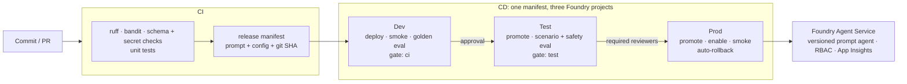

# Foundry Prompt Agent CI/CD

A GitHub Actions CI/CD setup for **prompt-based agents** on **Microsoft Foundry Agent
Service**, based on the Microsoft reference architecture
[CI/CD for AI Agents on Microsoft Foundry](https://techcommunity.microsoft.com/blog/educatordeveloperblog/cicd-for-ai-agents-on-microsoft-foundry/4522218).

It follows the article's two rules:

1. **The agent version is what you deploy.** Each build produces one release manifest
   containing the agent definition, the full prompt, a prompt hash and the git SHA.
   That same manifest goes to Dev, then Test, then Prod.
2. **Evaluation results decide whether a release moves on.** Before each promotion the
   agent must pass quality, safety and performance thresholds.

As the article describes for prompt-based agents, there is no Docker build or container
registry. CI validates the YAML definition and the prompt, and evaluation runs against
golden datasets.



## What's in the box

| Path | Purpose |
|---|---|
| [agent.yaml](agent.yaml) | Agent definition: name, model, prompt file, temperature, optional server-side tools, metadata |
| [prompts/system.md](prompts/system.md) | System instructions, versioned and code-reviewed like code |
| [schemas/agent.schema.json](schemas/agent.schema.json) | Schema validation for `agent.yaml` |
| [config/eval_gates.yaml](config/eval_gates.yaml) | Gate thresholds: `ci`, `test`, `prod` profiles |
| [eval/datasets/](eval/datasets) | Golden, scenario and smoke datasets (JSONL) |
| [scripts/](scripts) | Lifecycle scripts: validate, build manifest, deploy, promote, rollback, evaluate, gate |
| [.github/workflows/agent-cicd.yml](.github/workflows/agent-cicd.yml) | The full pipeline |
| [.github/workflows/rollback.yml](.github/workflows/rollback.yml) | Manual rollback (runs from the Actions tab) |
| [infra/](infra) | Bicep for one Foundry account + project per environment, plus OIDC setup scripts |
| [tests/unit/](tests/unit) | Tests for gates, metrics, config validation, SDK mapping and the deploy/promote/rollback lifecycle |
| [docs/](docs) | [Setup](docs/setup.md), [Runbook](docs/runbook.md), [Architecture notes](docs/architecture.md) |

## Evaluation gates

| Category | Metric | `ci` (Dev) | `test` / `prod` | How it's measured |
|---|---|---|---|---|
| Quality | Hallucination rate | < 5% | < 3% | `GroundednessEvaluator` score < 3 against the row's `context` |
| Quality | Task completion rate | > 90% | > 95% | Required keywords present **and** `RelevanceEvaluator` ≥ 3 |
| Safety | Grounded response rate | > 95% | > 98% | Groundedness ≥ 3 |
| Safety | Policy violations | 0 | 0 | `ContentSafetyEvaluator` severity ≥ Medium |
| Performance | p95 latency | < 4000 ms | < 3000 ms | Measured end to end against the deployed agent |
| Cost | Tokens per query | track only | fail on > 20% regression | Compared with `eval/baselines/test.json` |
| Reliability | Error rate | ≤ 5% | ≤ 2% / 0% | Failed agent calls |

If a threshold's metric wasn't computed (for example, evaluators were skipped), the gate
**fails**. You have to pass `--allow-missing` to let it through.

## Quick start

```bash
# 1. Local checks: the same commands as the CI validate job
python -m venv .venv && source .venv/bin/activate      # Windows: .venv\Scripts\activate
pip install -r requirements-dev.txt
ruff check . && bandit -c pyproject.toml -r scripts -ll
python scripts/validate_agent_config.py --config agent.yaml
pytest

# 2. Provision Azure (dev/test/prod Foundry projects)
PREFIX=contoso LOCATION=eastus2 ./infra/scripts/deploy-infra.sh

# 3. Create OIDC identities and print the GitHub variables to set
GITHUB_REPO=<org>/<repo> PREFIX=contoso ./infra/scripts/setup-github-oidc.sh
```

Then push to `main`. For the full walkthrough, see [docs/setup.md](docs/setup.md).

## Day-to-day workflow

1. Change `prompts/system.md` or `agent.yaml` on a branch and open a PR. CI validates the
   definition, scans for secrets and runs the tests.
2. Merge. The pipeline deploys to Dev and runs the golden-set evaluation. If the `ci` gate
   fails, the release stops there.
3. A reviewer approves Test. The pipeline runs the scenario and safety evaluation against
   the stricter `test` gate. If it fails, Test is rolled back automatically.
4. A reviewer approves Prod. The pipeline promotes the release, enables the endpoint and
   runs a smoke test. If the smoke test fails, Prod is rolled back automatically.

When the agent's job changes, update the evaluation datasets in the same PR as the prompt.
A stale golden set gives misleading gate results.

## Adapting it for the client

1. **Agent**: set `name` and `model` in `agent.yaml` and write the client's prompt in
   `prompts/system.md`.
2. **Knowledge and tools**: prompt agents run tools on the server. Add MCP servers,
   `file_search` (vector stores) or other server-side tools under `prompt.tools`. Function
   tools aren't allowed, because they need client code to run them.
3. **Datasets**: replace `eval/datasets/*.jsonl` with real, reviewed questions. In each
   row, `context` holds the facts the answer must be grounded in.
4. **Thresholds**: agree the numbers in `config/eval_gates.yaml` with the business owner.
   CODEOWNERS protects this file.
5. **Names**: replace `contoso` in the `infra/*.bicepparam` files and the team handles in
   `.github/CODEOWNERS`.

## How it maps to the article

| Article | This repo |
|---|---|
| Prompt agent CI: validate the YAML/prompt, evaluate against golden datasets | `validate` job + `validate_agent_config.py` (schema, secret scan, no function tools); golden-set eval in Dev |
| `run_evaluations.py` → `check_eval_gates.py` | Same script names and CLI flags; thresholds can also come from named profiles |
| `deploy_agent.py`, `promote_agent.py`, `get_active_version.py`, `enable_agent_endpoint.py`, `delete_agent_version.py` | Implemented with `azure-ai-projects` 2.x: `create_version` with `PromptAgentDefinition`, `update_details` (endpoint routing), `enable`/`disable`, `delete_version` |
| Promotion artefact = versioned prompt/config bundle | `release/manifest.json`, with the git SHA and prompt SHA-256 stamped on every version's metadata |
| Rollback = switch the active version | `promote_agent.py --from-env prod --to-env prod --agent-version N` re-routes the endpoint. Pipelines roll back automatically on Test/Prod failures |
| Option A: separate Dev/Test/Prod Foundry projects | `infra/main.bicep` deployed per environment, with one OIDC identity per environment |
| OIDC workload identity federation, approvals via GitHub Environments | `azure/login` with environment-scoped federated credentials; `test`/`prod` environments with required reviewers |
